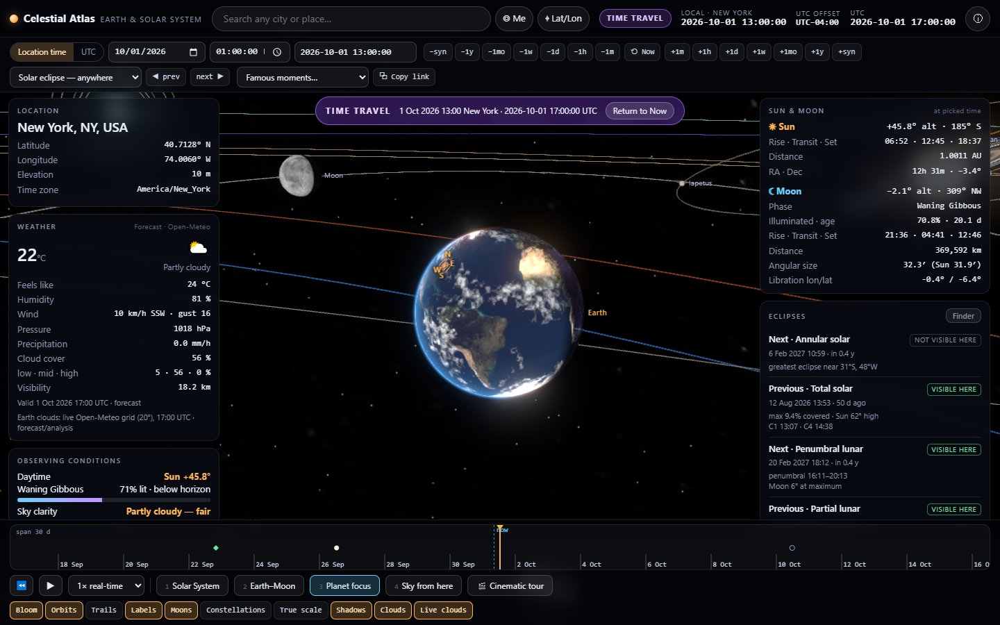
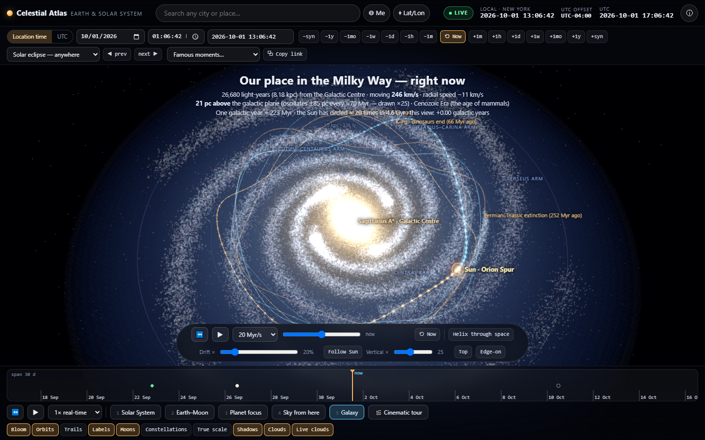
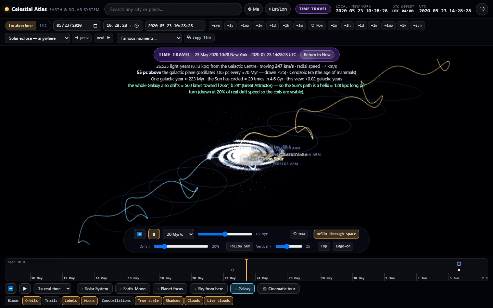
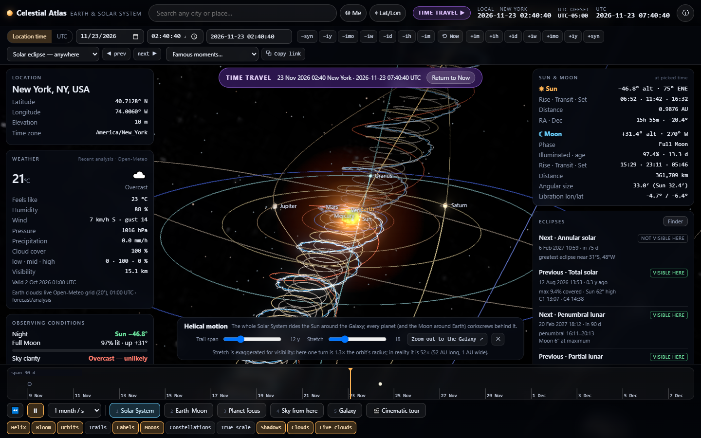
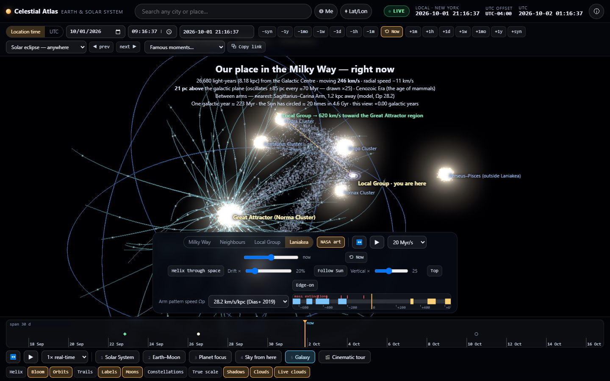

# Celestial Atlas

A cinematic, interactive 3D **Earth & Solar System** for any place on Earth and any moment from **1000 to 3000 CE** — in one self-contained HTML file.

**Live:** https://siten.ai/atlas/ · **Source:** this repo · MIT







## What it does

- **Any place** — search (Open-Meteo geocoding), "Me", or type lat/lon/elevation. Camera flies to a marker with a local-horizon grid and compass.
- **Time Travel** — calendar/time/ISO inputs (Location time or UTC), ±1 min…±1 year and ±synodic-month steps, a zoomable 1-day…500-year timeline with eclipse / Moon-phase / equinox markers, event jumps (eclipses anywhere or visible here, phases, solstices, oppositions, elongations, perihelion, meteor peaks), famous-moment presets, playback to 1 year/s, shareable URL hash.
- **Real astronomy** — [Astronomy Engine](https://github.com/cosinekitty/astronomy) for the Sun, planets, Moon, Galilean moons; JPL SSD mean elements for 14 more moons; IAU rotation models; Saturn's tilted rings. Topocentric alt/az, rise/set, phases, libration.
- **Eclipses with exact shadows** — per-pixel disc-overlap shading (Moon→Earth, Earth→Moon with red umbra, Jupiter's moons, Saturn's rings), shadow cones at true scale, live obscuration, local contact times, an eclipse finder, and a ground view with corona, diamond ring and "blood moon".
- **Weather that respects time** — forecast, ERA5 history (1940+) and clearly-labelled climatology; never invented. A live 20° Open-Meteo cloud grid is draped over the globe.
- **Galaxy view (press 5)** — zoom out to a procedural Milky Way (110,000 stars, four logarithmic spiral arms, bar, bulge, kiloparsec rings) and watch the Sun's real galactic orbit: one lap ≈ 223 Myr, radial swing 8.1–9.2 kpc, a ±85 pc bob through the plane every ≈ 70 Myr (exaggerated ×25 by a slider). Scrub or play ±650 Myr (dinosaur extinction and the Cambrian are marked), and switch on **Helix through space** to add the Galaxy's ≈ 560 km/s drift relative to the CMB so the path becomes a true helix.
- **Helical motion** — switch on **Helix** in the Solar System view and the planets (and the Moon around Earth) corkscrew behind the Sun as it carries the system at ≈ 246 km/s around the Galaxy. Honest scale note included (the true pitch is ≈ 52× the orbit radius).
- **Beyond the Galaxy** — scale buttons zoom from the Milky Way (with the NASA/JPL artist's-concept disc and rotating spiral pattern; an arm-crossing timeline for the Sun) to the Magellanic Clouds and dwarf satellites, the Local Group (Andromeda approaching at 110 km/s) and the Laniakea flow toward the Great Attractor.
- **Rendering** — Three.js r160, log-depth + floating origin, HDR bloom, Earth relief/night lights/clouds, Hubble galaxies, explorable and true-scale modes, 2,331 stars with proper motion, constellations, cinematic tour.

Accuracy vs JPL Horizons (topocentric, 1969–2026): Sun ≤ 1.2″, Moon ≤ 4.4″, planets ≤ 5″. 1700–2200 CE shows no warning; 1000–1700 and 2200–3000 show a "reduced accuracy" banner (Moon drifts to ~15′ by 2500). See `data/horizons_check.json`.

## Run

```bash
node scripts/serve.js 8765     # then open http://127.0.0.1:8765/
# or just open site/index.html (needs internet for the two CDN libraries and Open-Meteo)
```

## Build & test

```bash
pip install pillow playwright && npm i astronomy-engine@2.1.19
python scripts/build_assets.py         # textures, stars (+proper motion), constellations, satellite elements -> src/assets.js
node   scripts/build_eclipse_table.js  # all 9,641 eclipses 1000-3000 CE -> src/eclipses.js (~70 s)
python scripts/build_html.py           # -> site/index.html
node   scripts/test_logic.js           # 56 time/ephemeris/eclipse checks
node   scripts/horizons_check.js       # compare against JPL Horizons (network)
python scripts/verify_ui.py            # 60+ end-to-end checks in real Chrome (Playwright)
```

`data/raw/` holds the downloaded source textures and catalogs. The proper-motion source is not committed (13 MB): download `hyg/CURRENT/hygdata_v40.csv.gz` from [astronexus/HYG-Database](https://github.com/astronexus/HYG-Database) to `data/raw/hyg.csv.gz` before running `build_assets.py`.

## Credits

Planet/Milky Way textures [Solar System Scope](https://www.solarsystemscope.com/textures/) (CC BY 4.0, NASA-derived) · Earth/Moon/clouds/lights/relief from the three.js examples (NASA Visible Earth) · Hubble galaxies NASA/ESA via Wikimedia Commons · stars [d3-celestial](https://github.com/ofrohn/d3-celestial) (BSD-3) + [HYG database](https://github.com/astronexus/HYG-Database) (CC BY-SA 4.0) · satellite elements NASA/JPL SSD · weather & geocoding [Open-Meteo](https://open-meteo.com) (CC BY 4.0) · [three.js](https://threejs.org) (MIT) · [Astronomy Engine](https://github.com/cosinekitty/astronomy) (MIT).

Built by [Siten Sanghvi](https://siten.ai).
